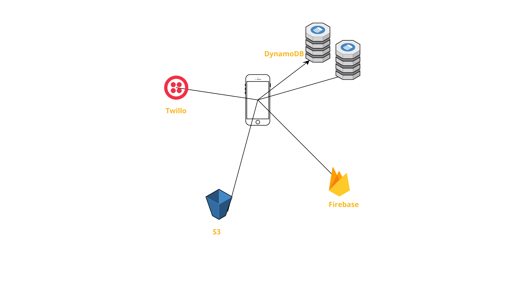

# Dracker
[![Swift Version][swift-image]][swift-url]

An iOS app to track/manage debt. This app allows users to create transactions, add descriptions, tag images, tag notes, and manage them. It features a rich and immersive user experience with 3D touch, quick actions, Actionable User Notifications, and Touch ID/Passcode capability for secure authentication.

## UI

#### Login/Register
&nbsp;&nbsp;&nbsp;&nbsp;

#### Dashboard
&nbsp;&nbsp;&nbsp;&nbsp;&nbsp;&nbsp;&nbsp;&nbsp;&nbsp;&nbsp;&nbsp;&nbsp;

#### Existing Transactions
&nbsp;&nbsp;&nbsp;&nbsp;

#### New Transactions
&nbsp;&nbsp;&nbsp;&nbsp;

#### Summary
&nbsp;&nbsp;&nbsp;&nbsp;

#### Profile
&nbsp;&nbsp;&nbsp;&nbsp;

#### Settings
&nbsp;&nbsp;&nbsp;&nbsp;&nbsp;&nbsp;&nbsp;&nbsp;

#### Security
&nbsp;&nbsp;&nbsp;&nbsp;

#### Miscellaneous
&nbsp;&nbsp;&nbsp;&nbsp;&nbsp;&nbsp;&nbsp;&nbsp;

## Features

### Current
- [x] Adding transactions with other people via phone number.
- [x] Registeration of new users/ Login functionality.
- [x] Authentication via Firebase
- [x] Unique QR Code and adding transaction using QR Code.
- [x] Access to data anywhere via AWS.
- [x] Text messages when payments are completed.
- [x] Taggable transactions. An image (such as a bill) can be tagged with the transaction.
- [x] Saving tagged images to camera roll.
- [x] Enabling/disabling user notifications.
- [x] Actionable notifications (ability to silence a particular payment reminder).
- [x] User ratings based on transaction history.
- [x] Enabling/disabling touch ID.
- [x] 3D touch compatibility for Quick Actions.
- [x] 3D touch for Dashbard table cells.

### Upcoming
- \[ ] Support for actually moving around money.

## Requirements

- iOS 10.0+
- Xcode 9.3
- Swift 4.1

## Architecture

- DynamoDB is used to store all the data for user transactions and other details
- S3 is used to store profile images and tagged images with transactions.
- Twillo is used to send messages for payment completion.
- Firebase is used for Authentication.
- SendGrid for emails.

## Libraries/Modules Used
- AWS (data storage)
- Twillo (payment completion notification)
- Firebase (Login/Authentication)
- DZNEmptyDataSet (For nice empty table look)
- Alamofire (API calls (to Twillo))
- SendGrid (for emailing note attached to a transaction)

## Meta

Raghav Bhasin – [@bhasin97](https://github.com/raghavbhasin97) – raghavbhasin97@gmail.com

[swift-image]:https://img.shields.io/badge/swift-4.0-orange.svg
[swift-url]: https://swift.org/

